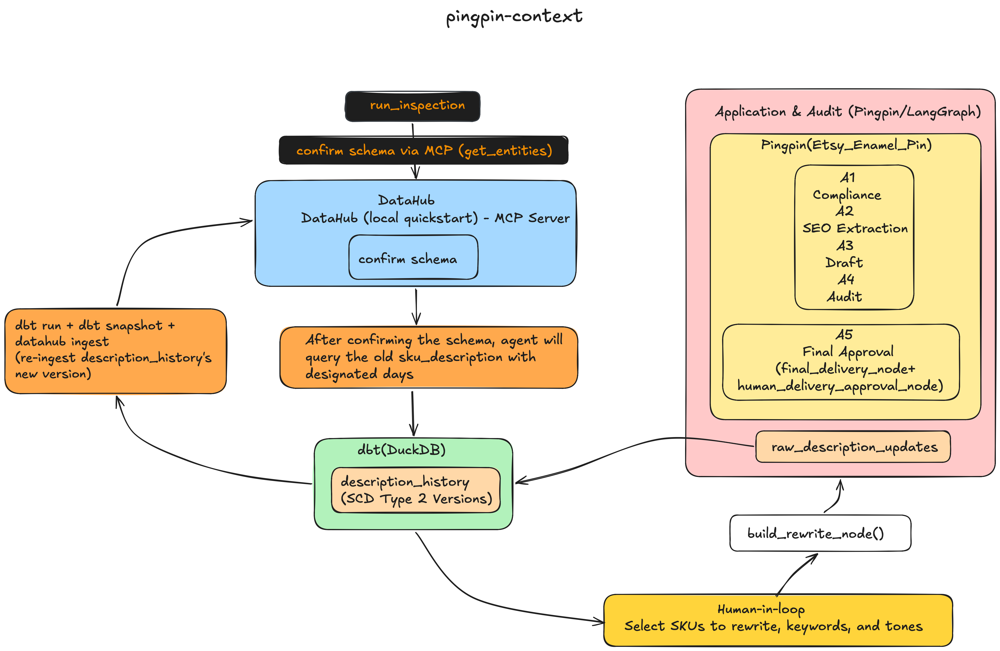

# 🔍 Pingpin Context — DataHub-Grounded Inspection Agent


An agent that reads DataHub through the **MCP Server** to understand a real dbt project's schema and lineage, finds product descriptions that have gone stale, gets human approval on what to rewrite, drives an existing multi-agent copywriting pipeline (`Etsy_Enamel_Pin`, included in this repo) to actually rewrite them, and writes the result back so the next inspection inherits the history — closing the loop between "data changed" and "someone should look at this."

Built for the **DataHub Agent Hackathon** (Agents That Do Real Work track).

> **Status: end-to-end working and verified against a live local DataHub + dbt/DuckDB stack.** A real run: `S001`'s description had gone 9 days without an update → the inspection agent read `description_history`'s schema through MCP → flagged it → a human selected it for rewrite and supplied keywords/tone → the request was routed through the *actual* Etsy_Enamel_Pin pipeline (A1 compliance → A2 SEO extraction → A3 draft → A4 audit, six human-in-the-loop revision rounds → A5 approval) → the new description was written back to `raw_description_updates` → `dbt snapshot` correctly closed out the old SCD2 version and opened a new one → `datahub ingest` reflected the change in DataHub's lineage graph. See [Demo](#demo) for the recording.

## The problem

Multi-agent systems that generate content have a state-management blind spot: once an agent writes a description, nothing tracks whether it's gone stale, and there's no structured way for *another* agent to find out and act on it. Left unaddressed, the fallback is a human manually diffing spreadsheets — the opposite of what an agentic pipeline is supposed to replace.

The harder problem underneath that: an agent that wants to query "which SKUs need attention" first needs to actually *understand* the data it's querying — not guess at column meanings from a table name. A dbt project isn't one readable file; it's YAML definitions, Jinja-templated SQL, and generated docs spread across directories. Parsing that fragmented structure just to answer "what does `dbt_valid_to` mean, and where did this table come from?" is not something worth re-solving per-agent.

## Architecture



The inspection agent is deliberately **not** a node inside Pingpin's existing `workflow` graph. It's a separate script that, once a human approves a rewrite, constructs an initial state and drives Pingpin's *already-compiled* `app` through its normal A1→A5 flow — reusing the pipeline's own compliance checks, audit gate, and approval checkpoints rather than bypassing them. See [Design choices](#design-choices) for why.

## Data model

| Table | Role | Notes |
|---|---|---|
| `dim_sku` (seed) | SKU identity registry | Dual-key: internal surrogate key (`sku_sk`) + seller-owned natural key. Surrogate is a persisted mapping, not a hash, because the natural key can be renamed without losing history. |
| `raw_description_updates` (dbt model) | Append-only log of description writes | `materialized='incremental'` — see [Known issues](#known-issues) for why this matters. |
| `description_history` (dbt snapshot) | SCD Type 2 version history | `strategy='check'` on `description_text` — identical content re-submitted produces **zero** new rows; only genuine changes open a new version and close the prior one. Verified with a dedicated idempotency smoke test. |

## The inspection agent, step by step

**1. Connect to DataHub via MCP.** `connect_to_datahub_mcp()` reads `DATAHUB_GMS_URL` / `DATAHUB_GMS_TOKEN` from the environment (never hardcoded — this repo's `dbt_duckdb_project/datahub_mcp_config.json` references them by name, not value, so a real token never ends up committed), opens a `uvx mcp-server-datahub@latest` subprocess over stdio, and completes the MCP handshake. Verified non-hallucinated: `mcp-cli tools` lists the real 8 DataHub tools, and calling `get_entities` on `dim_sku` returns the actual schema fields defined in this project, not an invented example.

**2. Query for staleness.** `query_stale_descriptions()` runs a parameterized query (`?` placeholders, never string-interpolated — a raw f-string here would be a SQL-injection surface) against `description_history` for `WHERE dbt_valid_to IS NULL AND dbt_valid_from < today - N days`.

**3. Build a layered report.** Each stale SKU becomes a `SkuDescriptionInspectReport` — a `facts` layer (SKU, current description, days since update: all directly queryable, non-negotiable) and a separate `inference` layer (`need_refresh`, `reason`, and a `basis` field locked to `Literal["rule-derived"]` — a type-level admission that today's judgment is a hardcoded threshold, not a model's guess; the field only needs to change if that ever stops being true). The split isn't cosmetic — it's the code-level version of "here's what I measured vs. here's what I'm recommending."

**4. Human-in-the-loop, on its own mini-graph.** `interrupt()` only works inside a compiled LangGraph runnable context; calling it from a bare function throws immediately. Rather than folding the inspection prompt into Pingpin's existing `workflow` (which has one entry point and no natural place for a pre-generation staleness check to live), the inspection step gets its own single-node `StateGraph` (`inspect_app`), compiled and driven independently. A human sees the flagged SKUs, picks which to rewrite, and supplies keywords + tone.

**5. Rewrite, through the real pipeline — not a shortcut.** For each selected SKU, `build_rewrite_initial_state()` constructs a state (using the stale description itself as `user_ideas`, since there's no original creative brief to fall back to) and drives Pingpin's compiled `app` through A1–A5 exactly as if a human had typed it in fresh — same compliance screening, same hard-gate/soft-score audit, same approval checkpoint. `write_raw_description_node` only fires after A5's `final_approval == "approved"`, so nothing lands in history without a human signing off.

**6. Write-back, without a new MCP write path.** Rather than building a bespoke "write to DataHub" tool, the loop closes through infrastructure already validated end-to-end: the new row lands in `raw_description_updates` → `dbt snapshot` picks it up as a new SCD2 version → `datahub ingest` reflects it in the graph. MCP's role stays strictly read-side: proving the agent grounds its actions in real schema, not inventing a redundant write mechanism when the existing pipeline already produces a correct one.

## Design choices

**Why a persisted surrogate key instead of a hash.** `dbt_utils.generate_surrogate_key()` is the standard move, but it derives the key from the natural key's current value — rename the natural key and the hash changes, silently orphaning history. Since sellers can rename SKUs, the registry persists a first-seen mapping instead: assign once, keep forever, regardless of later renames.

**Why the inspection flow stays outside Pingpin's `workflow`.** Two independent reasons: (1) `workflow` has a single fixed entry point (`compliance_check`) with no natural slot for "should I even be generating right now" logic; folding it in would mean reworking edges that are already tested and running in production. (2) The inspection agent's job — read DataHub, decide what's stale — has nothing in common with Pingpin's job of drafting copy. They're triggered by different events and reasoned about differently; forcing them into one graph would blur, not clarify, what each part does.

**Why `raw_description_updates` needs `materialized='incremental'`, not `table`.** This was a real bug caught during testing, not a design decision made in advance — worth stating plainly rather than presenting the final state as if it were obvious from the start. The model's `SELECT` intentionally returns zero rows (`LIMIT 0`) — its only job is to bootstrap an empty table shape that `raw_writer.py` then inserts real rows into directly. With `materialized='table'`, every `dbt run` executes `CREATE OR REPLACE TABLE ... AS SELECT` — a full rebuild that silently wipes whatever had been written to that physical table, including by an unrelated background process periodically re-running `dbt run`. `materialized='incremental'` only does the full build on first creation; every later run does `INSERT INTO ... SELECT`, and since the SELECT yields nothing, agent-written rows are left untouched. Caught by checking the actual row count after a run showed "success" in the logs, not by trusting the log output.

**Why report generation and the query layer never touch MCP.** MCP's tools (`search`, `get_lineage`, `get_entities`, etc.) read metadata — table shape, column meaning, lineage — not row-level data. Once the agent has confirmed via MCP that it understands `description_history`'s structure, the actual staleness query runs directly against DuckDB. MCP's value here is proving the agent grounded its query in a real, confirmed schema before running it — not serving as a general-purpose data API.

## Known issues

**Hard-gate exact-phrase matching can reject semantically valid copy.** Pingpin's A4 audit checks for use-case language via literal substring matching (`USE_CASE_SIGNALS = ["gift for", "perfect for", ...]`). During a live rewrite test, a description containing `"ideal for Ben Ming Nian gifting"` and `"perfect as a Spring Festival pin"` — clearly conveying gift/use-case context to a human reader — failed the gate because it didn't contain the *exact* string `"gift for"`. This is an existing limitation of Pingpin's rule-based hard gate, not something introduced by the inspection agent; a natural next step would be moving this specific check from exact-match to a semantic/embedding-based test. Left unfixed here deliberately — see the tradeoff below.

**SKU identity passthrough required a targeted fix.** `write_raw_description_node` originally called Pingpin's `get_or_create_sku_id()` unconditionally, which looks values up against `sku_natural_name` (a product-name column) rather than `sku_sk`. Since the inspection agent passes an already-known `sku_sk`, this caused a real SKU (`S001`) to be treated as "not found" and minted a brand-new, spurious SKU (`SK007`). Fixed by checking `dim_sku.sku_sk` directly before falling back to the natural-name lookup — Pingpin's original free-text-entry flow (where a genuinely new SKU has no existing `sku_sk` yet) still works unchanged.

**No `LocalDataSourceManager` for MCP write-back.** As noted above, this is a deliberate scope decision, not an oversight — see [Design choices](#design-choices).

## Repo layout & licensing

```
pingpin-context/
├── dbt_duckdb_project/        # dbt project: seeds, model, snapshot, DataHub ingestion config
├── Etsy_Enamel_Pin/           # Pingpin — the existing multi-agent listing pipeline (MIT-licensed,
│                               # included as-is; see Etsy_Enamel_Pin/LICENSE and its own README)
├── inspect_report_schema.py   # Inspection agent: MCP client, queries, report/rewrite data models
├── run_inspection.py          # Entry point — drives the full loop end to end
├── datahub_mcp_config.json    # MCP server config (reads credentials from env, never hardcoded)
└── LICENSE                    # Apache 2.0 — covers everything in this repo EXCEPT Etsy_Enamel_Pin/
```

This repository is licensed **Apache 2.0**. `Etsy_Enamel_Pin` is included so the pipeline is runnable out of the box, but retains its original **MIT** license — see the `LICENSE` file inside that directory.

## Setup

```bash
pip install -r requirements.txt
pip install -r Etsy_Enamel_Pin/requirements.txt
```

*(Two separate `requirements.txt` files: the root one covers the inspection agent — dbt, DuckDB, MCP, DataHub; the one inside `Etsy_Enamel_Pin/` covers Pingpin's own A1–A5 pipeline. Both are needed to run the full loop.)*

**1. Set Pingpin's LLM credentials** (Pingpin's A1–A5 pipeline calls Alibaba Cloud's DashScope Qwen-Plus model for compliance checking, SEO extraction, drafting, and audit scoring — you'll need your own DashScope API key to run the pipeline end-to-end):
```bash
export DASHSCOPE_API_KEY="<your DashScope API key>"
```

**2. Start DataHub locally:**
```bash
pip install acryl-datahub
datahub docker quickstart
```

**3. Set MCP credentials** (generate a Personal Access Token from the DataHub UI at `localhost:9002` → Settings → Access Tokens):
```bash
export DATAHUB_GMS_URL="http://localhost:8080"
export DATAHUB_GMS_TOKEN="<your token>"
```

**4. Build the dbt project:**
```bash
cd dbt_duckdb_project
dbt seed
dbt run
dbt snapshot
dbt docs generate
datahub ingest -c datahub_ingestion.yml
```

**5. Run the inspection agent:**
```bash
cd ../Etsy_Enamel_Pin/agents
python3 run_inspection.py
```

Follow the prompts: it lists stale SKUs, asks which to rewrite plus keywords/tone, then drives the real A1–A5 pipeline (including its own human-in-the-loop prompts for audit corrections and final approval).

## Tech stack

- **dbt-duckdb** — transformation, dimensional modeling, SCD Type 2 snapshot
- **DataHub** (local quickstart) — metadata catalog, lineage graph, MCP Server
- **Model Context Protocol** (`mcp`, `mcp-server-datahub`) — schema/lineage grounding for the agent
- **LangGraph** — the inspection agent's own mini-graph (for `interrupt()`), plus reuse of Pingpin's compiled `app`
- **Pydantic** — structured facts/inference/rewrite data contracts
- **Pingpin** (`Etsy_Enamel_Pin`) — the existing 5-agent LangGraph listing pipeline this project rewrites through; see its own README for full architecture detail

## Demo

[Link to demo video — under 3 minutes, shows the full loop: stale SKU flagged → human approval → real A1–A5 rewrite → DataHub lineage update]

## Project context

Built for the DataHub Agent Hackathon. The underlying multi-agent pipeline (`Etsy_Enamel_Pin`) is part of a separate, larger experiment comparing human-written, template-generated, and agent-generated Etsy listing copy — documented in its own README.